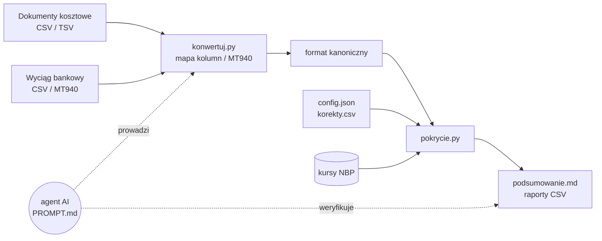

# Pokrycie kosztów — agent AI dla małej firmy

**Które faktury i paragony firma zapłaciła z konta firmowego, a które z prywatnej kieszeni?**

Agent porównuje dokumenty kosztowe z wyciągiem z konta firmowego i w kilka minut odpowiada:
ile kosztów **nie ma pokrycia** w wydatkach z konta (z przeliczeniem walut po kursie NBP), których wydatków z konta
**brakuje w dokumentach** i gdzie w danych są **błędy** — zanim trafią do księgowości.

`Python 3.9+` · `bez zależności` · `dane zostają na Twoim komputerze` · `CSV i MT940` · `po polsku` · `licencja MIT`

---

## Po co to jest

W małej firmie część kosztów płaci się firmową kartą, część przelewem, a część — prywatną kartą, gotówką albo
z innego rachunku. System księgowy zwykle pokazuje, że dokument jest „zapłacony”, ale nie mówi **skąd**.
Ręczne zestawianie kilkuset paragonów z wyciągiem zajmuje godziny i łatwo o pomyłkę.

Ten agent robi to za Ciebie i daje:

- **kwotę bez pokrycia** — sumę dokumentów, za które nie ma płatności z konta firmowego (np. do rozliczenia
  z właścicielem),
- **listę do sprawdzenia** — dopasowania prawdopodobne, ale niepewne (odległe daty, płatność w PLN za fakturę w USD),
- **wydatki bez dokumentu** — płatności z konta, do których brakuje faktury lub paragonu,
- **problemy z danymi** — błędy odczytu kwot (netto + VAT ≠ brutto), duplikaty, brak kwot, błędne terminy,
- **podsumowanie gotówki** — wypłaty z bankomatów obok dokumentów opłaconych gotówką.

## Jak pracuje agent

1. **Pyta o kontekst** — gdzie są pliki, który rachunek jest firmowy, jaki okres.
2. **Analizuje pliki** — sam rozpoznaje format wyciągu (CSV dowolnego banku albo MT940) i układ kolumn w pliku
   z dokumentami; przygotowuje mapę kolumn i sprawdza konwersję (liczba wierszy, sumy, zakres dat).
3. **Ustala z Tobą reguły** — które operacje pominąć (podatki, ZUS, rachunek VAT, przelewy własne), co jest opłatą
   bankową, a co wypłatą gotówki. Pokazuje tabelę i czeka na potwierdzenie.
4. **Dopasowuje** dokumenty do transakcji i przygotowuje raporty.
5. **Weryfikuje wynik** — przegląda pozycje niepewne i problemy z danymi, proponuje korekty (np. poprawienie błędnie
   odczytanej kwoty), liczy ponownie.
6. **Raportuje** — kwota bez pokrycia, najważniejsze pozycje, co poprawić w systemie źródłowym.

Instrukcja agenta jest w [`PROMPT.md`](PROMPT.md); obliczenia wykonują deterministyczne skrypty w Pythonie,
więc wynik jest powtarzalny i sprawdzalny.



## Przykładowy wynik

Fragment `podsumowanie.md` dla fikcyjnych danych z katalogu [`example/`](example/):

> | status | waluta | liczba | kwota PLN |
> |---|---|---:|---:|
> | pokryta | PLN | 9 | 4 850,00 |
> | do sprawdzenia | PLN | 1 | 400,00 |
> | do sprawdzenia | USD | 1 | 185,23 |
> | niepokryta | PLN | 5 | 2 279,99 |
> | niepokryta (USD) | USD | 2 | 445,76 |
> | brak kwoty | PLN | 1 | 0,00 |
>
> **Bez pokrycia: 2 725,75 zł** (+ 585,23 zł do sprawdzenia)
>
> **Gotówka:** wypłaty z konta 500,00 zł (1) · niepokryte dokumenty gotówkowe 500,00 zł (1)
>
> **Do sprawdzenia**
>
> | numer | kwota | transakcja | sposób |
> |---|---:|---|---|
> | INV-001 | 50,00 USD | 2026-03-18 188,00 EXAMPLE CLOUD | kurs NBP ±% |
> | HOT/12 | 400,00 PLN | 2026-03-06 400,00 BOOKING TEST | kwota+data |
>
> **Problemy z danymi**
>
> | numer | uwagi |
> |---|---|
> | INV-003 | netto+VAT (10.00+0.00) ≠ brutto (100.00) — błąd odczytu? |
> | PAR/0001 | duplikat numeru |
> | FV/9/2026 | termin ponad 30 dni przed datą dokumentu |

Obok podsumowania powstają raporty CSV (otwierają się w polskim Excelu): wszystkie dokumenty z dopasowaną
transakcją, dokumenty bez pokrycia z kwotą w PLN i kursem NBP (tabela, data kursu) oraz wydatki bez dokumentu.

## Szybki start

### Z agentem (zalecane)

Potrzebujesz agenta z dostępem do terminala, np. [Claude Code](https://claude.com/claude-code).

```bash
git clone <adres-repozytorium> pokrycie-kosztow
cd pokrycie-kosztow
mkdir -p ~/pokrycie/2026-q1          # katalog roboczy na Twoje dane — poza repozytorium
claude --add-dir ~/pokrycie/2026-q1
```

Pierwsza wiadomość do agenta:

```text
Przeczytaj PROMPT.md i przeprowadź mnie przez sprawdzenie pokrycia kosztów.
Dokumenty: ~/pokrycie/2026-q1/koszty.csv, wyciąg: ~/pokrycie/2026-q1/wyciag.csv, katalog roboczy: ~/pokrycie/2026-q1
```

Inny agent: wklej treść [`PROMPT.md`](PROMPT.md) jako pierwszą wiadomość i podaj ścieżki do plików.

### Bez agenta

```bash
T=/ścieżka/do/pokrycie-kosztow                                         # repozytorium z narzędziami
cd ~/pokrycie/2026-q1                                                  # katalog roboczy z danymi
cp $T/config.example.json config.json                                  # uzupełnij rachunek firmowy i reguły
python3 $T/konwertuj.py podglad wyciag.csv                             # kolumny, kodowanie, separator
python3 $T/konwertuj.py csv wyciag.csv --mapa mapa_wyciag.json -o transakcje.csv   # albo: mt940 wyciag.sta
python3 $T/konwertuj.py csv koszty.csv --mapa mapa_dokumenty.json -o dokumenty.csv
python3 $T/pokrycie.py config.json                                      # wyniki w wyniki/
```

Wzory map: [`example/mapa_wyciag.json`](example/mapa_wyciag.json), [`example/mapa_dokumenty.json`](example/mapa_dokumenty.json),
[`mapy/credit_agricole_csv.json`](mapy/credit_agricole_csv.json).

### Wypróbuj na danych przykładowych

```bash
cd example
python3 ../konwertuj.py csv dokumenty_zrodlo.csv --mapa mapa_dokumenty.json -o dokumenty.csv
python3 ../konwertuj.py mt940 wyciag.sta -o transakcje.csv
python3 ../pokrycie.py config.json
cat wyniki/podsumowanie.md
```

## Czego potrzebujesz

| | |
|---|---|
| **Dokumenty kosztowe** | plik CSV/TSV z fakturami i paragonami — dowolny układ kolumn (agent przygotuje mapę); minimum: numer, data, kwota brutto; im więcej (waluta, forma płatności, NIP, rachunek sprzedawcy, netto, VAT), tym lepsze dopasowanie i kontrole |
| **Wyciąg bankowy** | eksport historii rachunku firmowego do CSV albo MT940; najlepiej o 1–2 miesiące dłuższy niż okres dokumentów (faktury płaci się z opóźnieniem) |
| **Python 3.9+** | tylko biblioteka standardowa |
| **Internet** | tylko przy dokumentach w walutach obcych — kursy z `api.nbp.pl` |

## Jak działa dopasowanie

Każda płatność z konta pokrywa najwyżej jeden dokument. Pary wybierane są od najpewniejszych:

1. numer dokumentu w tytule przelewu (także zapisany bez zer wiodących),
2. rachunek sprzedawcy z faktury = rachunek odbiorcy przelewu,
3. ta sama kwota i najbliższa data (okno: od 31 dni przed dokumentem do 7 dni po nim dla karty i gotówki
   albo 60 dni po terminie dla przelewu),
4. dokument w walucie obcej zapłacony w PLN: kwota po kursie NBP ±5%.

Dodatkowo: kilka płatności u jednego sprzedawcy tego samego dnia za jeden dokument (np. bilet rozbity na kilka
transakcji) i jedna płatność za kilka dokumentów (np. dwa bilety na jednej transakcji).
Różnica 1 gr jest akceptowana tylko przy zgodnym numerze lub rachunku. Wypłat z bankomatu i opłat bankowych
nie dopasowuje się do dokumentów.

| status | znaczenie |
|---|---|
| `pokryta` | jest płatność z konta firmowego |
| `do sprawdzenia` | kwota się zgadza, ale data jest odległa o ponad 7 dni albo płatność była w innej walucie |
| `niepokryta`, `niepokryta (USD)`… | brak płatności z konta firmowego — wchodzi do kwoty **bez pokrycia** |
| `brak kwoty` | dokument bez kwoty — do uzupełnienia |
| `kwota ≤ 0` | pomijany (np. dokument zerowy) |

Kurs walut: średni kurs NBP (tabela A) z ostatniego dnia roboczego przed datą dokumentu — tak jak przy kosztach
w CIT; można przełączyć na kurs z dnia dokumentu.

## Prywatność

- Wszystkie obliczenia odbywają się lokalnie. Jedyne połączenie sieciowe to pobranie kursów walut z NBP
  (wysyłane są tylko kody walut i daty).
- Dane firmy trzymaj w katalogu roboczym **poza repozytorium**. `.gitignore` blokuje typowe nazwy plików z danymi,
  ale to tylko zabezpieczenie przed pomyłką.
- Agent nie modyfikuje plików źródłowych — poprawki danych zapisuje w `korekty.csv` z podaniem powodu.
- Dane w [`example/`](example/) są w całości fikcyjne.

## Ograniczenia

- Nie księguje, nie zmienia niczego w systemie księgowym ani w banku i nie jest poradą podatkową.
- Nie łączy się z bankiem — wyciąg trzeba pobrać samodzielnie.
- Płatności u jednego sprzedawcy z różnych dni nie są sumowane (np. faktura zbiorcza za cały miesiąc).
- Gotówka nie jest przypisywana do konkretnych dokumentów — agent pokazuje porównanie sum.
- Rachunek w walucie obcej: dopasowywane są tylko dokumenty w tej samej walucie.

<details>
<summary><b>Format kanoniczny plików</b></summary>

UTF-8, separator `;` (albo tabulator), daty `RRRR-MM-DD`, kwoty z kropką lub przecinkiem.
Jeśli inny system (albo inny agent) przygotowuje dokumenty, najprościej od razu w tym formacie.

**dokumenty.csv**

| kolumna | opis |
|---|---|
| `numer` | numer faktury / paragonu |
| `data` | data wystawienia (wymagana) |
| `termin` | termin płatności |
| `brutto` | kwota brutto (pusta = „brak kwoty”) |
| `netto`, `vat` | opcjonalne — kontrola netto + VAT = brutto |
| `waluta` | domyślnie PLN |
| `forma` | karta / przelew / gotówka / blik (albo card / transfer / cash) |
| `kontrahent`, `nip` | sprzedawca |
| `rachunek` | rachunek sprzedawcy z faktury |
| `opis` | dowolny |

**transakcje.csv**

| kolumna | opis |
|---|---|
| `data` | data operacji (albo księgowania) |
| `kwota` | ze znakiem: wydatek ujemny, wpływ dodatni |
| `waluta` | domyślnie PLN |
| `kontrahent` | odbiorca przelewu / akceptant karty |
| `rachunek_kontrahenta` | rachunek odbiorcy |
| `tytul` | tytuł przelewu |
| `kategoria` | typ operacji z banku (używany w regułach) |
| `rachunek` | rachunek własny, którego dotyczy operacja |

**korekty.csv** — `numer;nip;pole;wartosc;powod`, np. `FV/1/2026;;brutto;20.00;OCR: 200 zamiast 20`
(`nip` opcjonalnie, gdy numer się powtarza).

</details>

<details>
<summary><b>Mapa kolumn (<code>konwertuj.py csv</code>)</b></summary>

```json
{
  "typ": "transakcje",
  "kodowanie": "cp1250",
  "separator": ";",
  "pomin_wiersze": 0,
  "bez_cudzyslowow": false,
  "format_daty": "%d.%m.%Y",
  "kolumny": {
    "data": ["Data operacji", "Data księgowania"],
    "kwota": "Kwota",
    "kontrahent": ["Odbiorca", 23]
  },
  "stale": {"waluta": "PLN"}
}
```

| klucz | opis |
|---|---|
| `typ` | `transakcje` albo `dokumenty` |
| `kodowanie`, `separator` | opcjonalne — domyślnie wykrywane (utf-8 / cp1250; `;` `\t` `,` `\|`) |
| `pomin_wiersze` | wiersze przed nagłówkiem (preambuła niektórych banków) |
| `bez_cudzyslowow` | `true`, gdy `"` jest zwykłym znakiem w tekście |
| `format_daty` | format `strptime`; część po spacji (godzina) jest ignorowana |
| `kolumny` | pole kanoniczne → nazwa kolumny, numer kolumny (od 0; konieczny przy powtórzonych nagłówkach) albo lista (pierwsza niepusta); kwota jako `kwota` ze znakiem albo `wydatek` + `wplyw` |
| `stale` | wartości pól, których nie ma w pliku |

`konwertuj.py podglad PLIK` pokazuje numery kolumn, nagłówki i przykładowe wartości, a po konwersji skrypt
wypisuje statystyki (pominięte wiersze, zakres dat, sumy, rachunki, kategorie operacji) do porównania ze źródłem.
MT940 (`konwertuj.py mt940`) rozpoznaje podpola `:86:` w formatach `~NN`, `^NN`, `<NN`, `?NN`.

</details>

<details>
<summary><b>Konfiguracja (<code>config.json</code>)</b></summary>

Wzór: [`config.example.json`](config.example.json). Ścieżki są względne wobec pliku config.

| klucz | opis |
|---|---|
| `dokumenty`, `transakcje` (lista), `korekty`, `wyniki` | pliki wejściowe i katalog wyników |
| `rachunki_wlasne` | rachunki firmowe, z których płaci się za koszty (bez rachunku VAT); puste = wszystkie |
| `pomin` | regexy operacji, które nie są zapłatą za koszty (podatki, ZUS, rachunek VAT, przelewy własne) |
| `bez_dopasowania` | regexy opłat i prowizji — nie dopasowywane, widoczne w wydatkach bez dokumentu |
| `gotowka` | regexy wypłat gotówki — osobne podsumowanie |
| `reguly` | zmiana reguł dopasowania (niżej) |

Regexy są sprawdzane bez rozróżniania wielkości liter na tekście `kategoria | kontrahent | tytul`,
w kolejności `pomin` → `bez_dopasowania` → `gotowka`.

| `reguly` | domyślnie | znaczenie |
|---|---|---|
| `dni_przed` | 31 | zapłata najwcześniej tyle dni przed datą dokumentu |
| `dni_po` | 60 | przelew: najpóźniej tyle dni po terminie |
| `dni_po_karta` | 7 | karta / gotówka / BLIK: najpóźniej tyle dni po dacie dokumentu |
| `dni_pewne` | 7 | dopasowanie samą kwotą przy większej różnicy dat → „do sprawdzenia” |
| `tolerancja` | 0.01 | różnica groszowa — tylko przy zgodnym numerze lub rachunku |
| `tolerancja_walut` | 0.05 | ±5% przy płatności w PLN za dokument w walucie |
| `kurs_dzien_przed` | true | kurs NBP z dnia roboczego przed datą dokumentu; `false` = z dnia dokumentu |

</details>

<details>
<summary><b>Raporty (<code>wyniki/</code>)</b></summary>

| plik | zawartość |
|---|---|
| `podsumowanie.md` | sumy wg statusów, kwota bez pokrycia, gotówka, pozycje do sprawdzenia, problemy z danymi, dokumenty na granicy wyciągu, wydatki bez dokumentu, przyjęte reguły |
| `raport_koszty.csv` | wszystkie dokumenty: status, dopasowana transakcja, sposób dopasowania, uwagi, korekta |
| `raport_niepokryte.csv` | dokumenty bez pokrycia i do sprawdzenia: kwota w PLN, kwota i waluta oryginalna, kurs, tabela i data kursu NBP |
| `raport_wydatki_bez_dokumentu.csv` | wydatki z konta bez dokumentu (typ: wydatek / gotówka / opłata) |

Separator `;`, UTF-8 z BOM — pliki otwierają się poprawnie w polskim Excelu.

</details>

## Zawartość repozytorium

| plik | |
|---|---|
| [`PROMPT.md`](PROMPT.md) | instrukcja dla agenta AI: procedura, weryfikacja, typowe pułapki, zasady ochrony danych |
| [`pokrycie.py`](pokrycie.py) | dopasowanie dokumentów do transakcji, kontrole danych, raporty |
| [`konwertuj.py`](konwertuj.py) | podgląd plików, konwersja CSV (wg mapy) i MT940 do formatu kanonicznego |
| [`config.example.json`](config.example.json) | wzór konfiguracji |
| [`mapy/`](mapy/) | gotowe mapy kolumn wyciągów bankowych |
| [`example/`](example/) | fikcyjne dane: dokumenty, ten sam wyciąg w CSV i MT940, mapy, korekty, config |
| [`test_pokrycie.py`](test_pokrycie.py) | testy (bez sieci) — `python3 test_pokrycie.py` |
| [`LICENSE`](LICENSE) | licencja MIT |

Nowa mapa dla innego banku to plik JSON w `mapy/` — bez zmian w kodzie.

## Licencja

[MIT](LICENSE) — możesz używać, zmieniać i rozpowszechniać, także komercyjnie, zachowując informację o prawach
autorskich. Oprogramowanie jest dostarczane „tak jak jest”, bez gwarancji; wyniki nie zastępują weryfikacji
przez księgowego.
