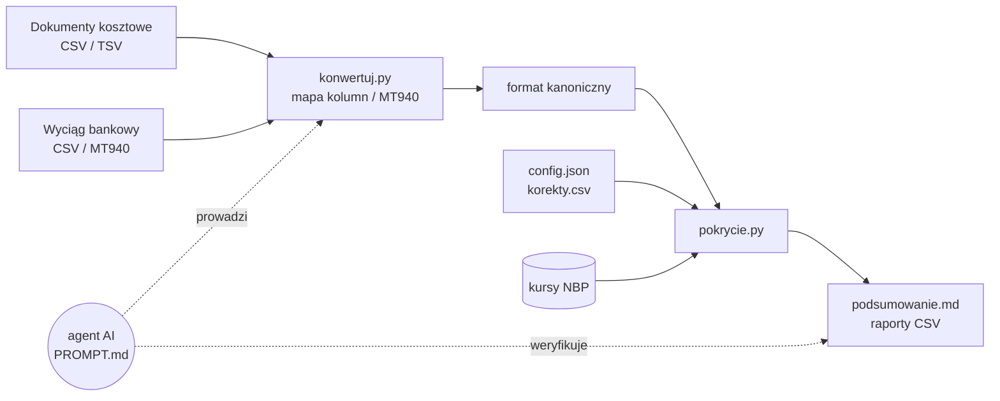

# Pokrycie kosztów — agent AI dla małej firmy

**Które faktury i paragony firma zapłaciła z konta firmowego, a które z prywatnej kieszeni?**

Agent porównuje dokumenty kosztowe z wyciągiem z konta firmowego i w kilka minut odpowiada:
ile kosztów **nie ma pokrycia** w wydatkach z konta (z przeliczeniem walut po kursie NBP), których wydatków z konta
**brakuje w dokumentach** i gdzie w danych są **błędy** — zanim trafią do księgowości.

`macOS · Windows · Linux` · `bez programowania` · `obliczenia na Twoim komputerze` · `wyciągi CSV i MT940` · `licencja MIT`

---

## Po co to jest

W małej firmie część kosztów płaci się firmową kartą, część przelewem, a część — prywatną kartą, gotówką albo
z innego rachunku. Program księgowy zwykle pokazuje, że dokument jest „zapłacony”, ale nie mówi **skąd**.
Ręczne zestawianie kilkudziesięciu paragonów/faktur z wyciągiem zajmuje czas i łatwo o pomyłkę.

Agent robi to za Ciebie i daje:

- **kwotę bez pokrycia** — sumę dokumentów, za które nie ma płatności z konta firmowego (np. do rozliczenia
  z właścicielem),
- **listę do sprawdzenia** — dopasowania prawdopodobne, ale niepewne (odległe daty, płatność w PLN za fakturę w USD),
- **wydatki bez dokumentu** — płatności z konta, do których brakuje faktury lub paragonu,
- **problemy z danymi** — błędnie odczytane kwoty (netto + VAT ≠ brutto), duplikaty, brak kwot, błędne terminy,
- **podsumowanie gotówki** — wypłaty z bankomatów obok dokumentów opłaconych gotówką.

## Jak zacząć — krok po kroku

Nie musisz umieć programować. Ty dostarczasz dwa pliki i odpowiadasz na pytania — resztę robi agent.

**Potrzebujesz:**

- komputera z **macOS 13+**, **Windows 10/11** albo **Linuksem** (Ubuntu/Debian),
- **płatnego konta Claude** (Pro, Max, Team lub Enterprise) — darmowy plan nie obejmuje Claude Code,
- **wyciągu z konta firmowego** (CSV albo MT940) i **listy faktur i paragonów** (CSV),
- Pythona **nie musisz instalować sam** — agent sprawdzi, czy jest, i w razie potrzeby zainstaluje go za Twoją zgodą.

### Krok 1. Zainstaluj aplikację Claude

| System | Co zrobić |
|---|---|
| **macOS** | Pobierz [Claude dla macOS](https://claude.ai/api/desktop/darwin/universal/dmg/latest/redirect), otwórz pobrany plik i przeciągnij Claude do folderu *Aplikacje*. |
| **Windows** | Pobierz [Claude dla Windows](https://claude.ai/api/desktop/win32/x64/setup/latest/redirect) i uruchom instalator (komputery z procesorem ARM: [wersja ARM64](https://claude.ai/api/desktop/win32/arm64/setup/latest/redirect)). |
| **Linux** | Zainstaluj według instrukcji [Claude Desktop na Linuksie](https://code.claude.com/docs/en/desktop-linux) (wersja beta, Ubuntu/Debian). |

Uruchom aplikację, zaloguj się i kliknij zakładkę **Code** na górze okna.

<details>
<summary>Wolisz terminal? Zainstaluj Claude Code w wersji tekstowej</summary>

| System | Polecenie |
|---|---|
| macOS, Linux | `curl -fsSL https://claude.ai/install.sh \| bash` |
| Windows (PowerShell) | `irm https://claude.ai/install.ps1 \| iex` |

Potem otwórz nowe okno terminala i sprawdź: `claude --version`.
Szczegóły i inne metody: [instalacja Claude Code](https://code.claude.com/docs/en/setup).

</details>

### Krok 2. Pobierz agenta

1. Otwórz stronę **https://github.com/marianwitkowski/ai-agent-pokrycie-kosztow**.
2. Kliknij zielony przycisk **Code** → **Download ZIP**.
3. Rozpakuj plik:
   - **macOS** — kliknij dwukrotnie pobrany plik ZIP,
   - **Windows** — kliknij prawym przyciskiem → **Wyodrębnij wszystkie…** → **Wyodrębnij**,
   - **Linux** — prawy przycisk → **Rozpakuj tutaj**.
4. Przenieś rozpakowany folder `ai-agent-pokrycie-kosztow` w wygodne miejsce, np. do *Dokumentów*.

(Znasz Git? `git clone https://github.com/marianwitkowski/ai-agent-pokrycie-kosztow.git`)

### Krok 3. Włóż swoje pliki do folderu `dane`

W folderze agenta jest folder **`dane`**. Skopiuj do niego:

- **wyciąg z konta firmowego** — w bankowości internetowej zwykle *Historia* / *Operacje* → *Eksport* / *Pobierz* →
  format **CSV** albo **MT940**; weź okres o 1–2 miesiące dłuższy niż okres dokumentów (faktury płaci się
  z opóźnieniem),
- **listę faktur i paragonów kosztowych** — plik CSV z programu księgowego lub od biura rachunkowego;
  plik z Excela zapisz jako CSV: *Plik → Zapisz jako → CSV UTF-8*.

Nazwy plików mogą być dowolne.

### Krok 4. Uruchom agenta

1. W aplikacji Claude, w zakładce **Code**, wybierz **Local** i kliknij **Select folder** — wskaż folder
   `ai-agent-pokrycie-kosztow`.
2. Wpisz i wyślij:

   ```text
   Przeczytaj PROMPT.md i przeprowadź mnie przez sprawdzenie pokrycia kosztów. Moje pliki są w folderze dane.
   ```

3. Agent poprosi o zgodę przed uruchamianiem poleceń — przeczytaj jednozdaniowe wyjaśnienie i zatwierdź.
   Najbezpieczniej pracować w trybie uprawnień **Manual** (przełącznik obok przycisku wysyłania).

<details>
<summary>Uruchomienie w terminalu (Claude Code w wersji tekstowej)</summary>

| System | Jak otworzyć terminal w folderze agenta | Start |
|---|---|---|
| macOS | *Terminal* (Cmd+Spacja → „Terminal”), wpisz `cd ` (ze spacją), przeciągnij folder agenta do okna, Enter | `claude` |
| Windows | Otwórz folder agenta w Eksploratorze, kliknij pasek adresu, wpisz `powershell`, Enter | `claude` |
| Linux | Prawy przycisk w folderze agenta → **Otwórz w terminalu** | `claude` |

Następnie wyślij tę samą wiadomość co wyżej.

</details>

### Krok 5. Rozmowa i wynik

Agent:

1. sprawdzi, czy jest Python, i w razie potrzeby **zainstaluje go** (poprosi o zgodę; system może zapytać o hasło
   albo pokazać okno „Czy zezwolić…?” — to normalne),
2. obejrzy Twoje pliki i zapyta o rzeczy, których nie da się z nich wyczytać — np. który rachunek jest firmowy,
3. pokaże, które rodzaje operacji zamierza pominąć (podatki, ZUS, przelewy własne), i poczeka na Twoje potwierdzenie,
4. policzy wynik, przejrzy pozycje niepewne i błędy w danych, zaproponuje poprawki,
5. poda **kwotę bez pokrycia** i najważniejsze wnioski.

Pliki z wynikami znajdziesz w **`dane/wyniki/`**:

| plik | otwórz w | zawartość |
|---|---|---|
| `podsumowanie.md` | dowolnym edytorze tekstu (albo poproś agenta o omówienie) | wszystkie sumy, pozycje do sprawdzenia, problemy z danymi |
| `raport_niepokryte.csv` | Excel / LibreOffice / Numbers | dokumenty bez pokrycia z kwotą w PLN i kursem NBP |
| `raport_koszty.csv` | Excel / LibreOffice / Numbers | wszystkie dokumenty i dopasowane płatności |
| `raport_wydatki_bez_dokumentu.csv` | Excel / LibreOffice / Numbers | płatności z konta, do których brakuje dokumentu |

## Przykładowy wynik

Fragment `podsumowanie.md` dla fikcyjnych danych z katalogu [`example/`](example/):

> | status | waluta | liczba | kwota PLN |
> |---|---|---:|---:|
> | pokryta | PLN | 9 | 4 850,00 |
> | do sprawdzenia | PLN | 1 | 400,00 |
> | do sprawdzenia | USD | 1 | 185,23 |
> | niepokryta | PLN | 5 | 2 279,99 |
> | niepokryta (USD) | USD | 2 | 445,76 |
> | brak kwoty | PLN | 1 | 0,00 |
>
> **Bez pokrycia: 2 725,75 zł** (+ 585,23 zł do sprawdzenia)
>
> **Gotówka:** wypłaty z konta 500,00 zł (1) · niepokryte dokumenty gotówkowe 500,00 zł (1)
>
> **Do sprawdzenia**
>
> | numer | kwota | transakcja | sposób |
> |---|---:|---|---|
> | INV-001 | 50,00 USD | 2026-03-18 188,00 EXAMPLE CLOUD | kurs NBP ±% |
> | HOT/12 | 400,00 PLN | 2026-03-06 400,00 BOOKING TEST | kwota+data |
>
> **Problemy z danymi**
>
> | numer | uwagi |
> |---|---|
> | INV-003 | netto+VAT (10.00+0.00) ≠ brutto (100.00) — błąd odczytu? |
> | PAR/0001 | duplikat numeru |
> | FV/9/2026 | termin ponad 30 dni przed datą dokumentu |

## Najczęstsze pytania

<details>
<summary><b>Ile to kosztuje?</b></summary>

Samo narzędzie jest bezpłatne (licencja MIT). Do pracy z agentem potrzebny jest płatny plan Claude
(Pro, Max, Team lub Enterprise) — [cennik](https://claude.com/pricing). Bez agenta, samymi skryptami, można korzystać
za darmo (sekcja „Dla zaawansowanych”).

</details>

<details>
<summary><b>Czy moje dane trafiają do internetu?</b></summary>

- **Obliczenia** wykonują skrypty na Twoim komputerze. Jedyne połączenie, jakie nawiązują, to pobranie kursów walut
  z Narodowego Banku Polskiego (wysyłane są tylko kody walut i daty).
- **Agent AI** działa w chmurze (Anthropic). To, co agent przeczyta, żeby wykonać zadanie — nagłówki plików,
  kilka przykładowych wierszy, podsumowania, pojedyncze pozycje do wyjaśnienia — trafia do rozmowy z modelem
  na zasadach Twojego konta Claude. Agent ma polecenie czytać tylko to, co potrzebne, i nie wczytywać całych plików.
- Jeśli dane nie mogą opuścić komputera, użyj samych skryptów, bez agenta.
- Twoje pliki w folderze `dane/` nie trafiają do repozytorium Git. Jeśli przekazujesz komuś folder agenta,
  najpierw usuń z niego swoje dane.

</details>

<details>
<summary><b>Czy agent coś zmieni w banku albo w programie księgowym?</b></summary>

Nie. Agent tylko czyta pliki, które mu dasz, i zapisuje raporty w `dane/wyniki/`. Nie łączy się z bankiem ani
z programem księgowym, nie zmienia Twoich plików źródłowych (poprawki zapisuje osobno, w `dane/korekty.csv`,
z podaniem powodu) i nie udziela porad podatkowych.

</details>

<details>
<summary><b>Mój bank daje tylko PDF.</b></summary>

PDF nie wystarczy. W bankowości internetowej (zwłaszcza firmowej) poszukaj eksportu historii rachunku do **CSV**
albo **MT940** — zwykle w *Historii* / *Operacjach*, opcja *Eksport*, *Pobierz* albo *Zestawienie*.

</details>

<details>
<summary><b>Mam dokumenty w Excelu.</b></summary>

Otwórz plik w Excelu i wybierz *Plik → Zapisz jako → CSV UTF-8 (rozdzielany przecinkami)*. Układ kolumn może być
dowolny — agent sam go rozpozna.

</details>

<details>
<summary><b>Agent prosi o hasło albo zgodę administratora.</b></summary>

Tak jest przy instalacji Pythona — to darmowy program potrzebny do obliczeń. Na Windows pojawi się okno
„Czy zezwolić…?” (kliknij **Tak**), na macOS okno instalacji narzędzi systemowych (kliknij **Zainstaluj**),
na Linuksie agent poprosi, żebyś sam wpisał polecenie z hasłem. Agent nigdy nie powinien prosić o hasło w rozmowie —
hasło wpisujesz tylko w okienku systemu.

</details>

<details>
<summary><b>Na Windows wpisanie „python” otwiera Microsoft Store.</b></summary>

To znaczy, że Pythona jeszcze nie ma. Agent zainstaluje go poleceniem `winget` albo poprosi o instalator
z [python.org](https://www.python.org/downloads/) (zaznacz wtedy **„Add python.exe to PATH”**). Po instalacji może
być potrzebne ponowne uruchomienie aplikacji Claude.

</details>

## Jak pracuje agent

1. **Sprawdza środowisko** — czy jest Python (w razie potrzeby instaluje za zgodą).
2. **Pyta o kontekst** — gdzie są pliki, który rachunek jest firmowy, jaki okres.
3. **Analizuje pliki** — rozpoznaje format wyciągu (CSV dowolnego banku albo MT940) i układ kolumn w pliku
   z dokumentami; przygotowuje mapę kolumn i sprawdza konwersję (liczba wierszy, sumy, zakres dat).
4. **Ustala z Tobą reguły** — które operacje pominąć (podatki, ZUS, rachunek VAT, przelewy własne), co jest opłatą
   bankową, a co wypłatą gotówki.
5. **Dopasowuje** dokumenty do płatności i przygotowuje raporty.
6. **Weryfikuje** — przegląda pozycje niepewne i problemy z danymi, proponuje korekty, liczy ponownie.
7. **Raportuje** — kwota bez pokrycia, najważniejsze pozycje, co poprawić w systemie źródłowym.

Instrukcja agenta jest w [`PROMPT.md`](PROMPT.md); obliczenia wykonują skrypty w Pythonie, więc wynik jest
powtarzalny i sprawdzalny.



### Jak działa dopasowanie

Każda płatność z konta pokrywa najwyżej jeden dokument. Pary wybierane są od najpewniejszych:

1. numer dokumentu w tytule przelewu (także zapisany bez zer wiodących),
2. rachunek sprzedawcy z faktury = rachunek odbiorcy przelewu,
3. ta sama kwota i najbliższa data (okno: od 31 dni przed dokumentem do 7 dni po nim dla karty i gotówki
   albo 60 dni po terminie dla przelewu),
4. dokument w walucie obcej zapłacony w PLN: kwota po kursie NBP ±5%.

Dodatkowo: kilka płatności u jednego sprzedawcy tego samego dnia za jeden dokument (np. bilet rozbity na kilka
transakcji) i jedna płatność za kilka dokumentów (np. dwa bilety na jednej transakcji).
Różnica 1 gr jest akceptowana tylko przy zgodnym numerze lub rachunku. Wypłat z bankomatu i opłat bankowych
nie dopasowuje się do dokumentów.

| status | znaczenie |
|---|---|
| `pokryta` | jest płatność z konta firmowego |
| `do sprawdzenia` | kwota się zgadza, ale data jest odległa o ponad 7 dni albo płatność była w innej walucie |
| `niepokryta`, `niepokryta (USD)`… | brak płatności z konta firmowego — wchodzi do kwoty **bez pokrycia** |
| `brak kwoty` | dokument bez kwoty — do uzupełnienia |
| `kwota ≤ 0` | pomijany (np. dokument zerowy) |

Kurs walut: średni kurs NBP (tabela A) z ostatniego dnia roboczego przed datą dokumentu — tak jak przy kosztach
w CIT; można przełączyć na kurs z dnia dokumentu.

### Ograniczenia

- Nie księguje, nie zmienia niczego w programie księgowym ani w banku i nie jest poradą podatkową.
- Nie łączy się z bankiem — wyciąg trzeba pobrać samodzielnie (CSV albo MT940; PDF nie wystarczy).
- Płatności u jednego sprzedawcy z różnych dni nie są sumowane (np. faktura zbiorcza za cały miesiąc).
- Gotówka nie jest przypisywana do konkretnych dokumentów — agent pokazuje porównanie sum.
- Rachunek w walucie obcej: dopasowywane są tylko dokumenty w tej samej walucie.

## Dla zaawansowanych

<details>
<summary><b>Python — instalacja ręczna</b></summary>

Wymagany Python 3.9 lub nowszy, bez dodatkowych bibliotek.

| System | Sprawdzenie | Instalacja | Polecenie w dalszych krokach |
|---|---|---|---|
| Windows | `py -3 --version` | `winget install -e --id Python.Python.3.12` albo instalator z [python.org](https://www.python.org/downloads/) (zaznacz **Add python.exe to PATH**) | `py` |
| macOS | `python3 --version` | `xcode-select --install`, `brew install python` albo instalator z [python.org](https://www.python.org/downloads/macos/) | `python3` |
| Linux | `python3 --version` | Debian/Ubuntu: `sudo apt install python3`, Fedora: `sudo dnf install python3` | `python3` |

</details>

<details>
<summary><b>Praca bez agenta (same skrypty)</b></summary>

Skopiuj pliki do `dane/`, przygotuj mapy kolumn (wzory: [`example/mapa_wyciag.json`](example/mapa_wyciag.json),
[`example/mapa_dokumenty.json`](example/mapa_dokumenty.json), [`mapy/credit_agricole_csv.json`](mapy/credit_agricole_csv.json))
i uzupełnij `config.json` (rachunek firmowy, reguły).

**macOS / Linux** (Terminal, w folderze agenta):

```bash
cd dane
cp ../config.example.json config.json                                   # uzupełnij rachunek firmowy i reguły
python3 ../konwertuj.py podglad wyciag.csv                              # kolumny, kodowanie, separator
python3 ../konwertuj.py csv wyciag.csv --mapa mapa_wyciag.json -o transakcje.csv   # albo: mt940 wyciag.sta -o transakcje.csv
python3 ../konwertuj.py csv koszty.csv --mapa mapa_dokumenty.json -o dokumenty.csv
python3 ../pokrycie.py config.json                                      # wyniki w dane/wyniki/
```

**Windows** (PowerShell, w folderze agenta):

```powershell
cd dane
Copy-Item ..\config.example.json config.json                            # uzupełnij rachunek firmowy i reguły
py ..\konwertuj.py podglad wyciag.csv
py ..\konwertuj.py csv wyciag.csv --mapa mapa_wyciag.json -o transakcje.csv      # albo: mt940 wyciag.sta -o transakcje.csv
py ..\konwertuj.py csv koszty.csv --mapa mapa_dokumenty.json -o dokumenty.csv
py ..\pokrycie.py config.json
```

**Dane przykładowe** — w folderze `example/` (na Windows `py` zamiast `python3` i `\` zamiast `/`):

```bash
cd example
python3 ../konwertuj.py csv dokumenty_zrodlo.csv --mapa mapa_dokumenty.json -o dokumenty.csv
python3 ../konwertuj.py mt940 wyciag.sta -o transakcje.csv
python3 ../pokrycie.py config.json
```

</details>

<details>
<summary><b>Format kanoniczny plików</b></summary>

UTF-8, separator `;` (albo tabulator), daty `RRRR-MM-DD`, kwoty z kropką lub przecinkiem.
Jeśli inny system (albo inny agent) przygotowuje dokumenty, najprościej od razu w tym formacie.

**dokumenty.csv**

| kolumna | opis |
|---|---|
| `numer` | numer faktury / paragonu |
| `data` | data wystawienia (wymagana) |
| `termin` | termin płatności |
| `brutto` | kwota brutto (pusta = „brak kwoty”) |
| `netto`, `vat` | opcjonalne — kontrola netto + VAT = brutto |
| `waluta` | domyślnie PLN |
| `forma` | karta / przelew / gotówka / blik (albo card / transfer / cash) |
| `kontrahent`, `nip` | sprzedawca |
| `rachunek` | rachunek sprzedawcy z faktury |
| `opis` | dowolny |

**transakcje.csv**

| kolumna | opis |
|---|---|
| `data` | data operacji (albo księgowania) |
| `kwota` | ze znakiem: wydatek ujemny, wpływ dodatni |
| `waluta` | domyślnie PLN |
| `kontrahent` | odbiorca przelewu / akceptant karty |
| `rachunek_kontrahenta` | rachunek odbiorcy |
| `tytul` | tytuł przelewu |
| `kategoria` | typ operacji z banku (używany w regułach) |
| `rachunek` | rachunek własny, którego dotyczy operacja |

**korekty.csv** — `numer;nip;pole;wartosc;powod`, np. `FV/1/2026;;brutto;20.00;OCR: 200 zamiast 20`
(`nip` opcjonalnie, gdy numer się powtarza).

</details>

<details>
<summary><b>Mapa kolumn (<code>konwertuj.py csv</code>)</b></summary>

```json
{
  "typ": "transakcje",
  "kodowanie": "cp1250",
  "separator": ";",
  "pomin_wiersze": 0,
  "bez_cudzyslowow": false,
  "format_daty": "%d.%m.%Y",
  "kolumny": {
    "data": ["Data operacji", "Data księgowania"],
    "kwota": "Kwota",
    "kontrahent": ["Odbiorca", 23]
  },
  "stale": {"waluta": "PLN"}
}
```

| klucz | opis |
|---|---|
| `typ` | `transakcje` albo `dokumenty` |
| `kodowanie`, `separator` | opcjonalne — domyślnie wykrywane (utf-8 / cp1250; `;` `\t` `,` `\|`) |
| `pomin_wiersze` | wiersze przed nagłówkiem (preambuła niektórych banków) |
| `bez_cudzyslowow` | `true`, gdy `"` jest zwykłym znakiem w tekście |
| `format_daty` | format `strptime`; część po spacji (godzina) jest ignorowana |
| `kolumny` | pole kanoniczne → nazwa kolumny, numer kolumny (od 0; konieczny przy powtórzonych nagłówkach) albo lista (pierwsza niepusta); kwota jako `kwota` ze znakiem albo `wydatek` + `wplyw` |
| `stale` | wartości pól, których nie ma w pliku |

`konwertuj.py podglad PLIK` pokazuje numery kolumn, nagłówki i przykładowe wartości, a po konwersji skrypt
wypisuje statystyki (pominięte wiersze, zakres dat, sumy, rachunki, kategorie operacji) do porównania ze źródłem.
MT940 (`konwertuj.py mt940`) rozpoznaje podpola `:86:` w formatach `~NN`, `^NN`, `<NN`, `?NN`.

</details>

<details>
<summary><b>Konfiguracja (<code>config.json</code>)</b></summary>

Wzór: [`config.example.json`](config.example.json). Ścieżki są względne wobec pliku config.

| klucz | opis |
|---|---|
| `dokumenty`, `transakcje` (lista), `korekty`, `wyniki` | pliki wejściowe i katalog wyników |
| `rachunki_wlasne` | rachunki firmowe, z których płaci się za koszty (bez rachunku VAT); puste = wszystkie |
| `pomin` | regexy operacji, które nie są zapłatą za koszty (podatki, ZUS, rachunek VAT, przelewy własne) |
| `bez_dopasowania` | regexy opłat i prowizji — nie dopasowywane, widoczne w wydatkach bez dokumentu |
| `gotowka` | regexy wypłat gotówki — osobne podsumowanie |
| `reguly` | zmiana reguł dopasowania (niżej) |

Regexy są sprawdzane bez rozróżniania wielkości liter na tekście `kategoria | kontrahent | tytul`,
w kolejności `pomin` → `bez_dopasowania` → `gotowka`.

| `reguly` | domyślnie | znaczenie |
|---|---|---|
| `dni_przed` | 31 | zapłata najwcześniej tyle dni przed datą dokumentu |
| `dni_po` | 60 | przelew: najpóźniej tyle dni po terminie |
| `dni_po_karta` | 7 | karta / gotówka / BLIK: najpóźniej tyle dni po dacie dokumentu |
| `dni_pewne` | 7 | dopasowanie samą kwotą przy większej różnicy dat → „do sprawdzenia” |
| `tolerancja` | 0.01 | różnica groszowa — tylko przy zgodnym numerze lub rachunku |
| `tolerancja_walut` | 0.05 | ±5% przy płatności w PLN za dokument w walucie |
| `kurs_dzien_przed` | true | kurs NBP z dnia roboczego przed datą dokumentu; `false` = z dnia dokumentu |

</details>

## Zawartość repozytorium

| plik | |
|---|---|
| [`PROMPT.md`](PROMPT.md) | instrukcja dla agenta AI: środowisko, procedura, weryfikacja, typowe pułapki, zasady ochrony danych |
| [`dane/`](dane/) | tu wkładasz swoje pliki; tu powstają wyniki (poza repozytorium Git) |
| [`pokrycie.py`](pokrycie.py) | dopasowanie dokumentów do płatności, kontrole danych, raporty |
| [`konwertuj.py`](konwertuj.py) | podgląd plików, konwersja CSV (wg mapy) i MT940 do formatu kanonicznego |
| [`config.example.json`](config.example.json) | wzór konfiguracji |
| [`mapy/`](mapy/) | gotowe mapy kolumn wyciągów bankowych — nowy bank to nowy plik JSON, bez zmian w kodzie |
| [`example/`](example/) | fikcyjne dane: dokumenty, ten sam wyciąg w CSV i MT940, mapy, korekty, config |
| [`test_pokrycie.py`](test_pokrycie.py) | testy (bez sieci) — `python3 test_pokrycie.py` (Windows: `py test_pokrycie.py`) |
| [`LICENSE`](LICENSE) | licencja MIT |

## Licencja

[MIT](LICENSE) — możesz używać, zmieniać i rozpowszechniać, także komercyjnie, zachowując informację o prawach
autorskich. Oprogramowanie jest dostarczane „tak jak jest”, bez gwarancji; wyniki nie zastępują weryfikacji
przez księgowego.
